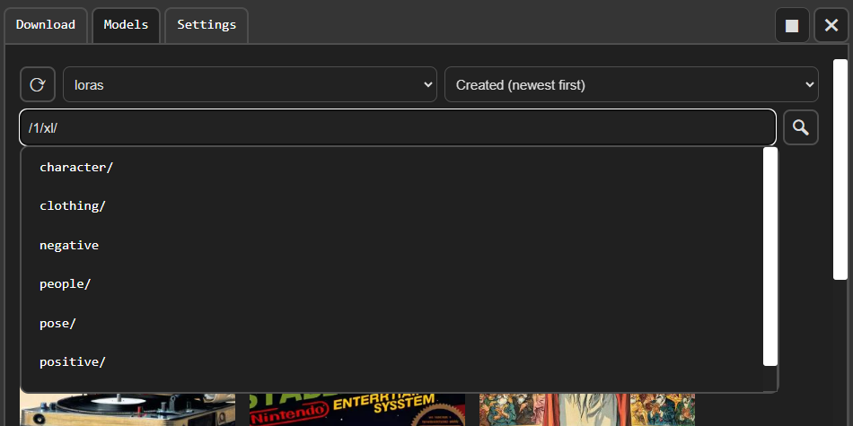
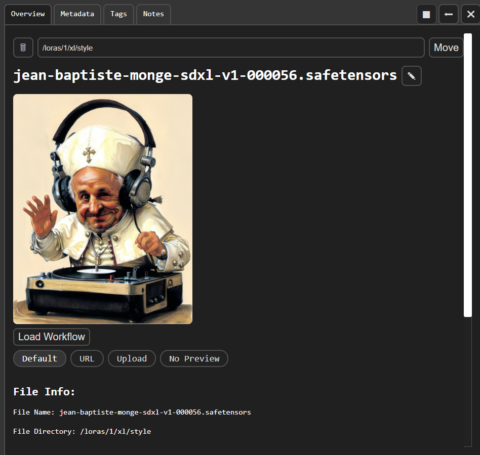

# comfyui-model-manager

Download, browse and delete models in ComfyUI.

## Features

### Download Tab

- View multiple models associated with a url.
- Select a download directory.
- Optionally also download a model preview image (a default image along side the model, from another url or locally uploaded).
- Optionally also download descriptions as a note (`.txt` file).
- Civitai and HuggingFace API token configurable in `server_settings.yaml`.

### Models Tab

- Search bar in models tab.
- Advanced keyword search using `"multiple words in quotes"` or a minus sign to `-exclude`.
- Search `/`subdirectories of model directories based on your file structure (for example, `/0/1.5/styles/clothing`).
  - Add `/` at the start of the search bar to see auto-complete suggestions.
- Include models listed in ComfyUI's `extra_model_paths.yaml` or added in `ComfyUI/models/`.
- Sort for models (Date Created, Date Modified, Name).

### Model Info View

- View model metadata and file info.
- Read, edit and save notes in a `.txt` file beside the model.
  - `Ctrl+S` to save when note textarea is in focus.
  - Optionally enable autosave.
- Change or remove a model's preview image (add a different one using a url or local upload).
- Rename, move or **permanently** remove model files.

### ComfyUI Node Graph

- Button to copy a model to the ComfyUI clipboard or embedding to system clipboard. (Embedding copying requires secure http connection.)
- Button to add model to ComfyUI graph or embedding to selected nodes. (For small screens/low resolution.)
- Button to load workflows embedded in previews. (Can alternatively drag full-sized image in model info onto node graph.)
- Right, left, top and bottom toggleable sidebar modes.
- Drag a model onto the graph to add a new node.
- Drag a model onto an existing node to set the model field. (Must be exact on input if multiple inputs use model name text.)
- Drag an embedding onto a text area, or highlight any number of nodes, to add it to the end.
- Drag preview image in model info onto the graph to load embedded workflow.

### Settings Tab

- Settings tab saved in `ui_settings.yaml`.
  - Hide/Show 'add' and 'copy-to-clipboard' buttons.
  - Text to always included in search.
  - Show/Hide add embedding extension.
- Colors follow ComfyUI's current theme.

### Known Issues

- Pinch to Zoom can cause an invisible scrolling bug.
