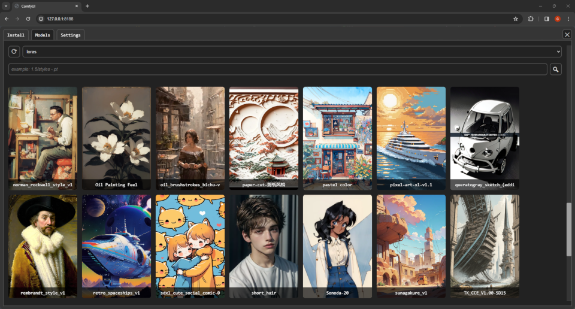

# comfyui-model-manager

Browse models in ComfyUI. (Downloading and deleting are WIP.)

## About this fork

I made this fork because the original repo was inactive and missing many things I needed to make the ComfyUI usable. Also, many other custom nodes bundle unrelated features together or search the internet in the background.

Currently it is still missing some features it should have.

## Fork Improvements

- Search bar in models tab.
- Advanced keyword search using `"multiple words in quotes"` or a minus sign to `-exclude`.
- Search `/`subdirectories of model directories based on your file structure (for example, `/0/1.5/styles/clothing`).
  - Add `/` at the start of the search bar to see auto-complete suggestions.
- Include models listed in ComfyUI's `extra_model_paths.yaml` or added in `ComfyUI/models`.
- Button to copy a model to the ComfyUI clipboard or embedding to system clipboard. (Embedding copying requires secure http connection.)
- Button to add model to ComfyUI graph or embedding to selected nodes. (For small screens/low resolution.)
- Right, left, top and bottom toggleable sidebar modes.
- Drag a model onto the graph to add a new node.
- Drag a model onto an existing node to set the model field.
- Drag an embedding onto a text area to add it to the end.
- Increased supported preview image types.
- Correctly change colors using ComfyUI's theme colors.
- Simplified UI.
- Settings tab and config file.
  - Hide/Show 'add' and 'copy-to-clipboard' buttons.
  - Text to always search.
  - Show/Hide add embedding extension.

## TODO:

### Code

- &#9744; Javascript cleanup.
  - &#9744; Seperate into classes per tab?
  - &#9744; HTML generation all inside main class?
  - &#9744; More server driven, HTMX-like HTML generation? (Avoid x2 states)

### Model Copying

- &#9744; Copy image?

### Model info window/panel (server load/send on demand)

- &#9744; Info icon `ⓘ` button to view.
- &#9744; Optional (re)download `📥︎` model info from the internet and cache the text file locally. (requires checksum?)
  - &#9744; Radio buttons to swap between downloaded and server view.
- &#9744; Delete model with warning popup.

### Settings

- &#9744; Exclude hidden folders with a `.` prefix.
- &#9744; Enable optional checksum to detect if a model is already downloaded.
- &#9744; Sidebar width.

### Search filtering and sort

- &#9744; Filters dropdown
  - &#9744; Stable Diffusion model version/Clip/Upscale/?
  - &#9744; Favorites
- &#9744; Sort-by dropdown
  - &#9744; Date modified (ascending/decending)
  - &#9744; Date created (ascending/decending)
  - &#9744; Recently used (ascending/decending)
  - &#9744; Frequently used (ascending/decending)
- &#9744; `or` vs `and` type of keyword search (currently `and`)

### Image preview

- &#9744; Support multiple preview images. (swipe?)
- &#9744; Show preview images for videos.
  - &#9744; If ffmpeg or cv2 available, extract the first frame of the video and use as image preview.
  - &#9744; Play preview video?

### Accessibility

- &#9744; Proper naming and labeling.
- &#9744; Tool tips?

### Sidebar

- &#9744; Drag sidebar width/height dynamically.

### Directory Browser and Downloading tab

(NOTE: It is a impossible to put a model automatically in the correct folder if model type information is not given or ambigious. To fully solve this requires making a file browser where files can be moved around.)

- &#9744; Replace Install tab with Downloading tab (more practical IMO).
- &#9744; Download a model from a url.
- &#9744; Choose save path/directory to download within vaild model directories. (Alert Yes/No if need to create new dirs?)
