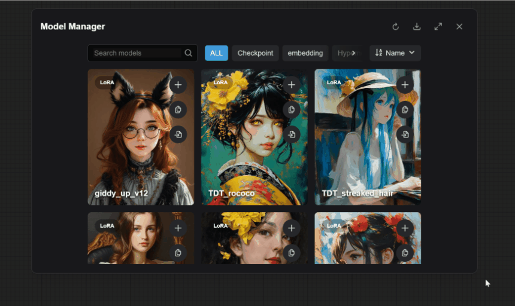
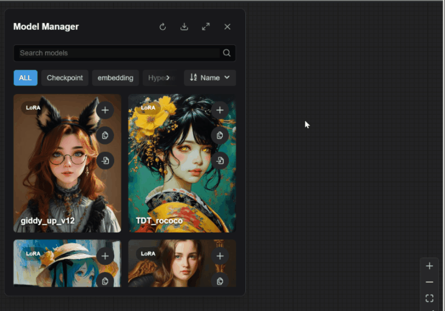
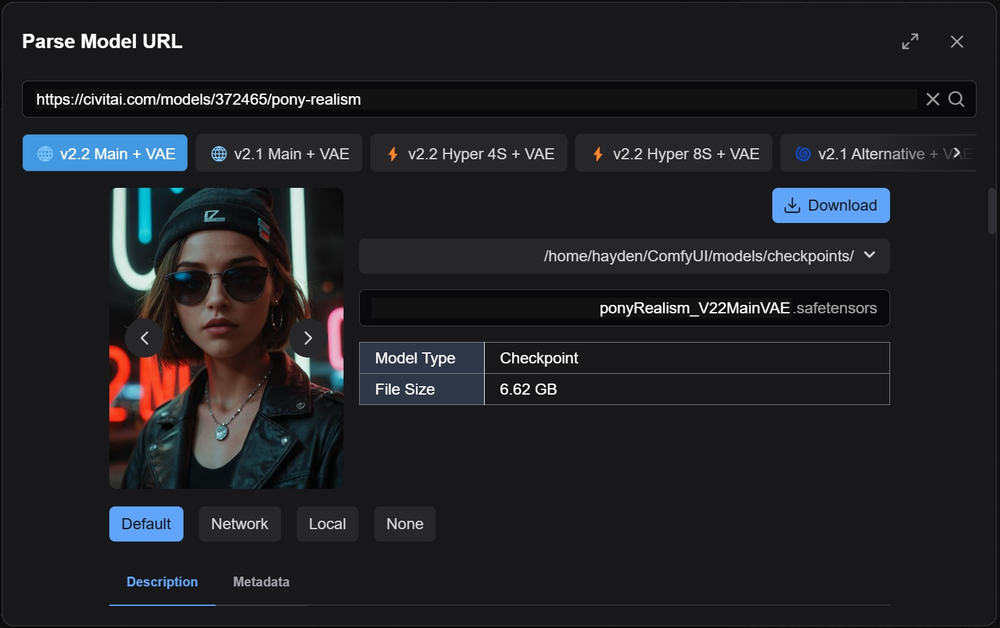
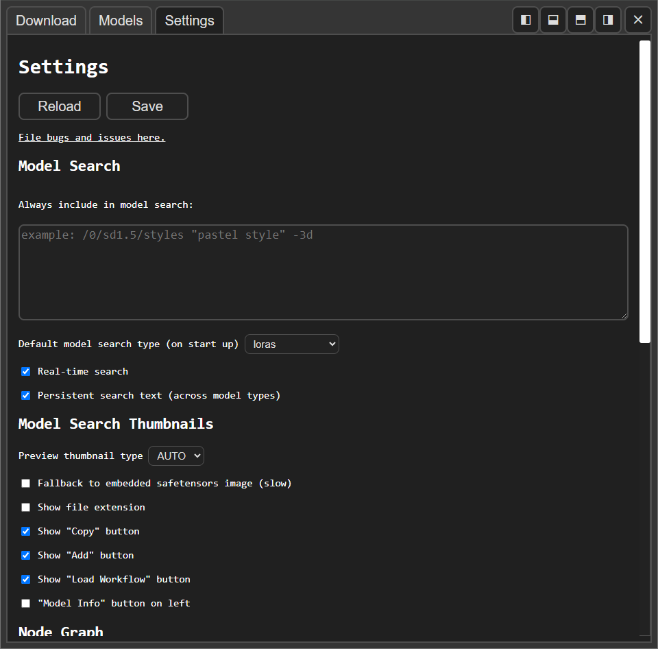
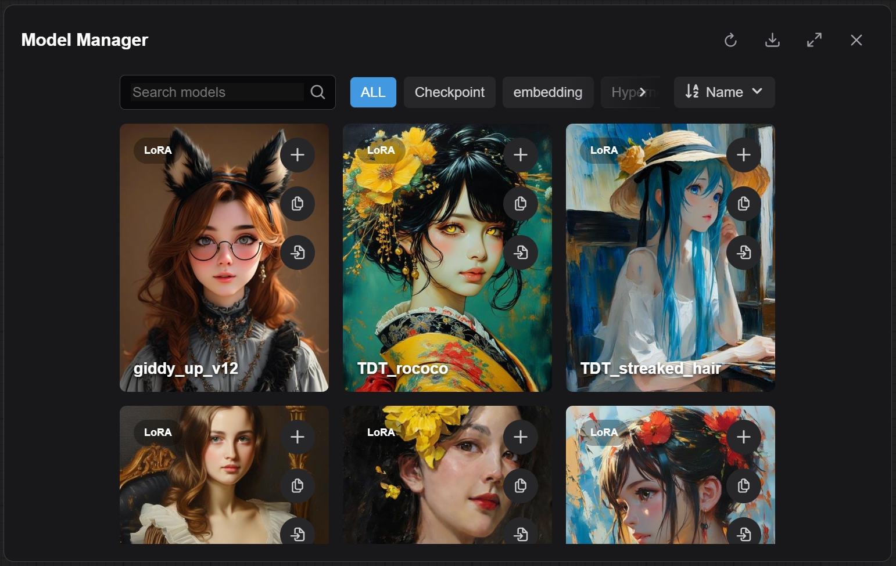
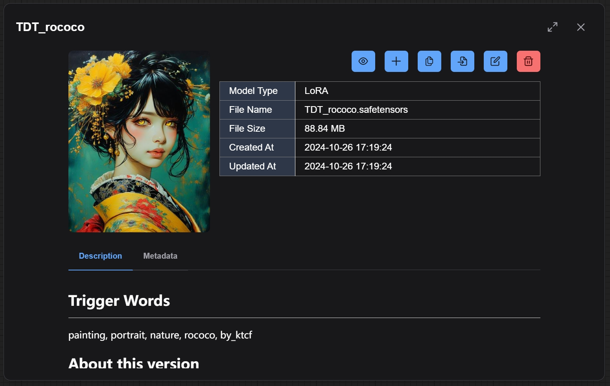
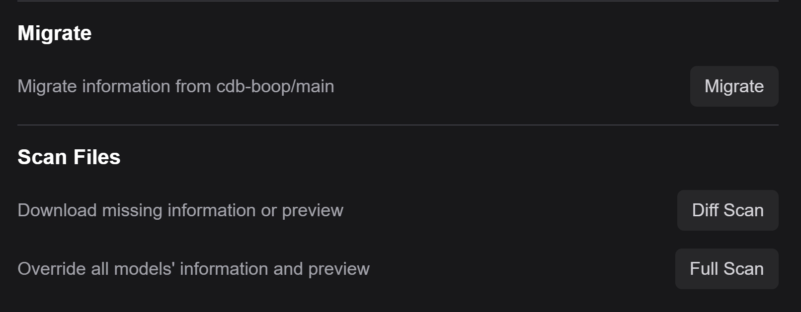

# comfyui-model-manager

Download, browse and delete models in ComfyUI.

Designed to support desktop, mobile and multi-screen devices.

# Usage

```bash
cd /path/to/ComfyUI/custom_nodes
git clone https://github.com/hayden-fr/ComfyUI-Model-Manager.git
cd /path/to/ComfyUI/custom_nodes/ComfyUI-Model-Manager
npm install
npm run build
```

## Features

## Freely adjust size and position



### Support Node Graph



- Drag a model thumbnail onto the graph to add a new node.
- Drag a model thumbnail onto an existing node to set the input field.
  - If there are multiple valid possible fields, then the drag must be exact.
- Drag an embedding thumbnail onto a text area, or highlight any number of nodes, to append it onto the end of the text.
- Drag the preview image in a model's info view onto the graph to load the embedded workflow (if it exists).
- Press the "copy" button to copy a model to ComfyUI's clipboard or copy the embedding to the system clipboard. (Copying the embedding to the system clipboard requires a secure http connection.)
- Press the "add" button to add the model to the ComfyUI graph or append the embedding to one or more selected nodes.
- Press the "load workflow" button to try and load a workflow embedded in a model's preview image.

### Download Tab



- View multiple models associated with a url.
- Select a save directory and input a filename.
- Optionally set a model's preview image.
- Optionally edit and save descriptions as a .md note.
- Add Civitai and HuggingFace API tokens in ComfyUI's settings.



### Models Tab



- Search in real-time for models using the search bar.
- Sort models by "Name", "File Size", "Date Created" and "Date Modified".

### Model Info View



- View file info and metadata.
- Rename, move or **permanently** remove a model and all of it's related files.
- Read, edit and save notes. (Saved as a `.md` file beside the model).
- Change or remove a model's preview image.
- View training tags and use the random tag generator to generate prompt ideas. (Inspired by the one in A1111.)

### Scan Model Information



- Scan models and try to download information & preview.
- Support migration from `cdb-boop/ComfyUI-Model-Manager/main`
