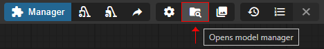
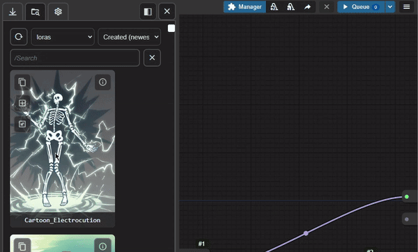
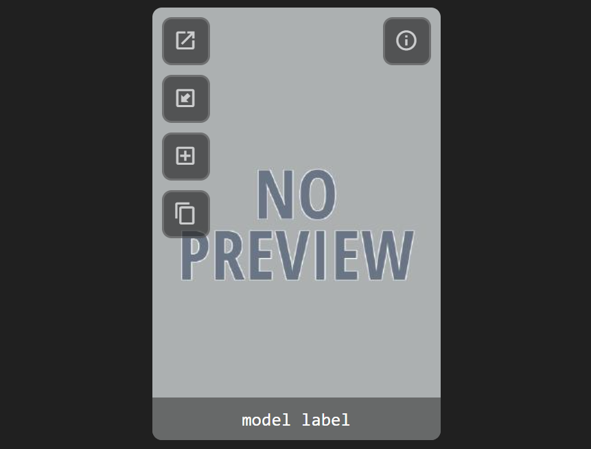

# comfyui-model-manager

Download, browse and delete models in ComfyUI.

Designed to support desktop, mobile and multi-screen devices.

## Features

### Node Graph

- Drag a model thumbnail onto the graph to add a new node.
- Drag a model thumbnail onto an existing node to set the input field.
  - If there are multiple valid possible fields, then the drag must be exact.
- Drag an embedding thumbnail onto a text area, or highlight any number of nodes, to append it onto the end of the text.
- Drag the preview image in a model's info view onto the graph to load the embedded workflow (if it exists).

- Press the "copy" button to copy a model to ComfyUI's clipboard or copy the embedding to the system clipboard. (Copying the embedding to the system clipboard requires a secure http connection.)
- Press the "add" button to add the model to the ComfyUI graph or append the embedding to one or more selected nodes.
- Press the "load workflow" button to try and load a workflow embedded in a model's preview image.

### Download Tab

- View multiple models associated with a url.
- Select a save directory and input a filename.
- Optionally set a model's preview image.
- Optionally save descriptions as a .txt note. (Default option can be set in the settings tab.)
- Add Civitai and HuggingFace API tokens in `server_settings.yaml`.

### Models Tab

- Search in real-time for models using the search bar.
- Use advance keyword search by typing `"multiple words in quotes"` or a minus sign before to `-exclude` a word or phrase.
- Add `/` at the start of a search to view a dropdown list of subdirectories (for example, `/0/1.5/styles/clothing`).
  - Any directory paths in ComfyUI's `extra_model_paths.yaml` or directories added in `ComfyUI/models/` will automatically be detected.
- Sort models by "Date Created", "Date Modified", "Name" and "File Size".

### Model Info View

- View file info and metadata.
- Rename, move or **permanently** remove a model and all of it's related files.
- Read, edit and save notes. (Saved as a `.txt` file beside the model).
  - `Ctrl+s` to save a note when the textarea is in focus.
  - Autosave can be enabled in settings. (Note: Once the model info view is closed, the undo history is lost.)
- Change or remove a model's preview image.
- View training tags and use the random tag generator to generate prompt ideas.

### Settings Tab

- The settings tab settings are saved to `ui_settings.yaml`.
- Most settings should update immediately, but a few may require a page reload to take effect.
- Press the "Fix Extensions" button to correct all image file extensions in the model directories. (Note: This may take a minute or so to complete.)
