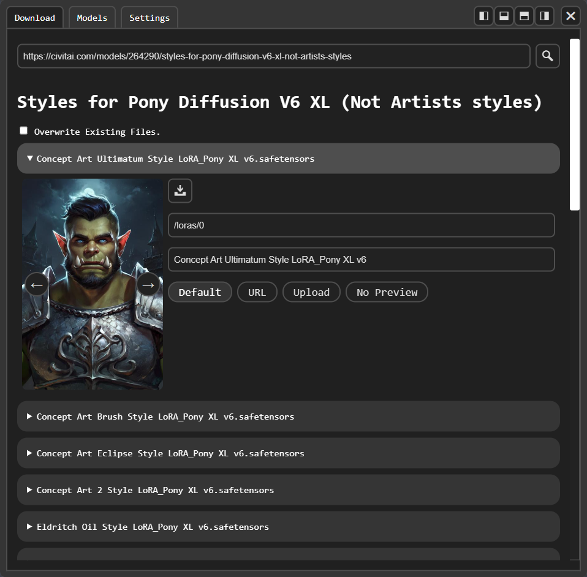
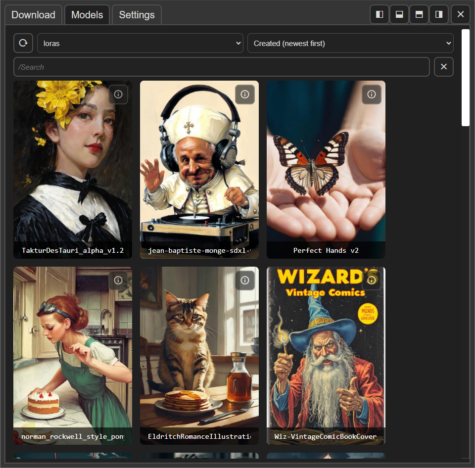

# comfyui-model-manager

Download, browse and delete models in ComfyUI.

  
  

## Features

### Download Tab

- View multiple models associated with a url.
- Select a download directory.
- Optionally also download a model preview image (a default image along side the model, from another url or locally uploaded).
- Civitai and HuggingFace API token configurable in `server_settings.yaml`.

### Models Tab

- Search bar in models tab.
- Advanced keyword search using `"multiple words in quotes"` or a minus sign to `-exclude`.
- Search `/`subdirectories of model directories based on your file structure (for example, `/0/1.5/styles/clothing`).
  - Add `/` at the start of the search bar to see auto-complete suggestions.
- Include models listed in ComfyUI's `extra_model_paths.yaml` or added in `ComfyUI/models`.
- Sort for models (Date Created, Date Modified, Name).

### Model Info View

- View model metadata, including training tags and bucket resolutions.
- Read, edit and save notes in a `.txt` file beside the model.
- Change or remove a model's preview image (add a different one using a url or local upload).
- Rename, move or **permanently** remove models.

### ComfyUI Node Graph

- Button to copy a model to the ComfyUI clipboard or embedding to system clipboard. (Embedding copying requires secure http connection.)
- Button to add model to ComfyUI graph or embedding to selected nodes. (For small screens/low resolution.)
- Right, left, top and bottom toggleable sidebar modes.
- Drag a model onto the graph to add a new node.
- Drag a model onto an existing node to set the model field.
- Drag an embedding onto a text area to add it to the end.

### Settings Tab

- Settings tab saved in `ui_settings.yaml`.
  - Hide/Show 'add' and 'copy-to-clipboard' buttons.
  - Text to always search.
  - Show/Hide add embedding extension.
- Colors follow ComfyUI's current theme.

## TODO

### Download Model

- Checkbox to optionally save description in `.txt` file for Civitai. (what about "About Model"?)
- Server setting to enable creating new folders (on download, on move).

### Download Model Info

- Auto-save notes? (requires debounce and save confirmation)
- Load workflow from preview (Should be easy to add with ComfyUI built-in clipboard.)
- Default weights on add/drag? (optional override on drag?)
- Optional (re)download `📥︎` model info from the internet and cache the text file locally. (requires checksum?)
  - Radio buttons to swap between downloaded and server view.

### Sidebar

- Drag sidebar width/height dynamically.

### Accessibility

- Proper naming, labeling, alt text, etc. for html elements.
- Tool tips.
- Better error messages.

### Image preview

- Better placeholder preview. (with proper spelling!)
- Show preview images for videos.
  - If ffmpeg or cv2 available, extract the first frame of the video and use as image preview.

### Settings

- Toggle exclusion of "hidden folders" with a `.` prefix.
- Sidebar default width/height.
- Toggle non-uniform preview sizes. (How to handle extreme aspect ratios?)

### Search filtering and sort

- Real-time search
  - Check search code is optimized to avoid recalculation on every minor input change
- Filter directory dropdown
  - Filter directory content in auto-suggest dropdown (not clear how this should be implemented)
- Filters dropdown
  - Stable Diffusion model version, if applicable (Maybe dropdown list of "Base Models" is more pratical to impliment?)
  - Favorites
- Swap between `and` and `or` keyword search? (currently `and`)

